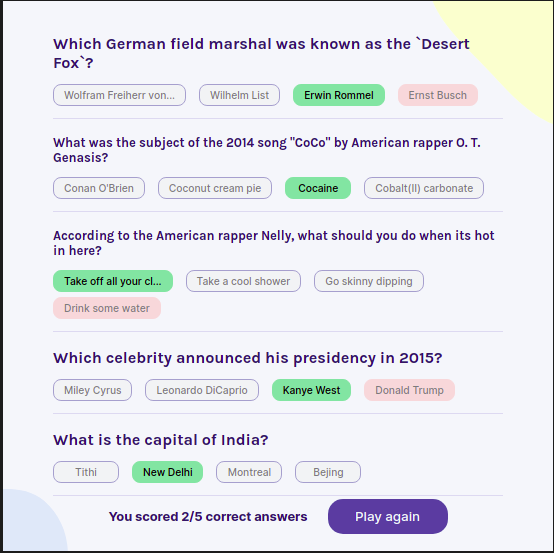

# Practice from Freecodecamp video 

[React Course Video](https://www.youtube.com/watch?v=bMknfKXIFA8).

## Quizzical Game - all around
* Two screens (start & questions)
* Pull 5 questions from the [OTDB API](https://opentdb.com/api.php?amount=5)
* Tally correct answers after "Check answers" is clicked

This project was bootstrapped with [Vite](https://vitejs.dev).

## Available Scripts

In the project directory, you can run:

### `npm run dev`

Runs the app in the development mode.\
Open [http://localhost:3000](http://localhost:3000) to view it in your browser.

#### Personal note. 

Sanitizer text - I think is not necessary, but today is ok.\
Use custom hooks